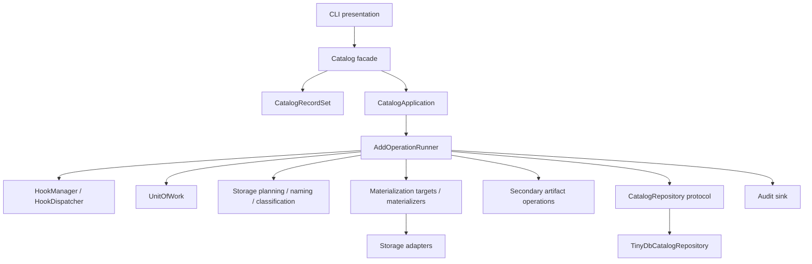
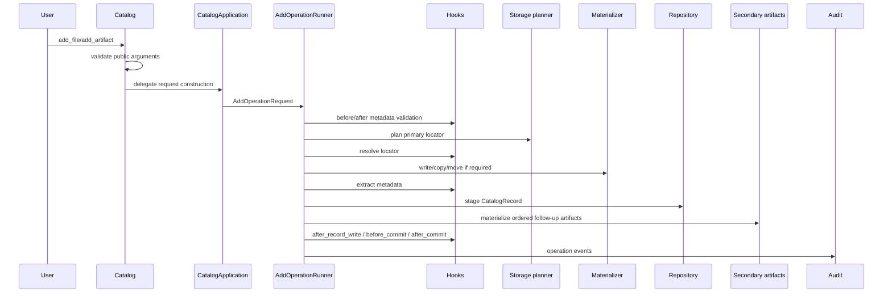
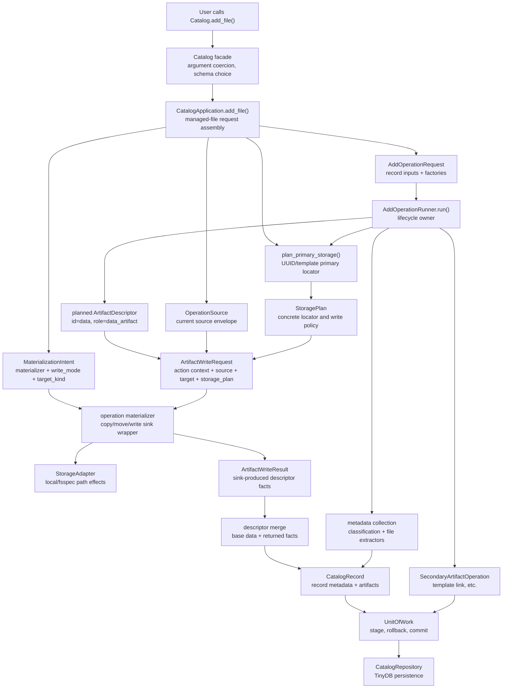
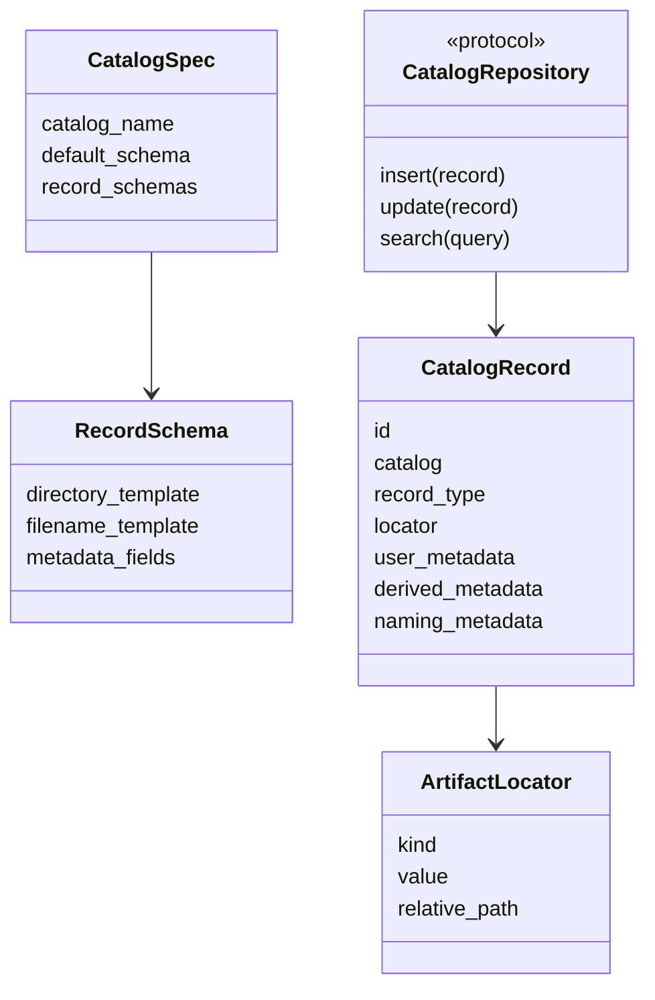

# Current Architecture Report

This report contains dated architecture snapshots. Each snapshot records the
state of the code at the time it was written; it is not a claim that the
structure is final.

The diagrams use GitHub-rendered Mermaid fences. This report is excluded from
the Sphinx documentation build until the architecture and docs rendering setup
are stable enough to publish diagrams in the generated docs site.

## Snapshot 1: Post #84-#92 Refactor Train

Date: historical snapshot after #84-#92, before the #117/#119 terminology
cleanup.

This historical snapshot describes the architecture after the #84 refactor
train through #92. It predates the #117/#119 terminology cleanup around
operation materializers, writer capabilities, and structured writer results.
The main design direction was to keep `Catalog`, `CatalogRecordSet`, and the
CLI as public presentation surfaces while moving orchestration, domain policy,
and persistence behind clearer internal interfaces.

### Layer Map



| Layer | Components | Main responsibility |
|-------|------------|---------------------|
| Presentation/API | `Catalog`, `CatalogRecordSet`, CLI | Public Python and command-line workflows, argument coercion, user-facing compatibility |
| Application/orchestration | `CatalogApplication`, `AddOperationRunner`, operation requests/services, hooks, unit of work | Operation sequencing, rollback boundaries, hook dispatch, audit coordination |
| Domain/policy | naming, storage planning, materialization intent, classification, validation, replica planning, secondary artifacts | Catalog rules that are independent of the storage backend |
| Data/infrastructure | repositories, TinyDB implementation, storage adapters, materializers, audit sink | Persistence and filesystem or fsspec side effects |

### Primary Add Flow



## Snapshot 2: 2026-05-19 Managed Add File Artifact Flow

Date: 2026-05-19

This section is a focused snapshot of `Catalog.add_file()` after the artifact
descriptor and `ArtifactWriteResult` work. It intentionally excludes hook
behavior so the intrinsic data-add roles are visible. Hooks still run in the
real `AddOperationRunner` lifecycle.

### Process Diagram



### Intrinsic Stages And Current Owners

| Intrinsic stage | Current code owner | Role in the problem |
|-----------------|--------------------|---------------------|
| User intent and API compatibility | `Catalog.add_file()` | Accept a familiar path-oriented call, resolve the source path, choose schema/templates, normalize options, and delegate. |
| Operation request assembly | `CatalogApplication.add_file()` | Turn public arguments into a managed-file add command: source envelope, storage planning functions, materializer choice, metadata collector, secondary artifacts, and transaction ownership. |
| Source description | `OperationSource` | Current operation source envelope. It carries path/payload/provenance fields. Its modern replacement should be a source `ArtifactDescriptor` plus selected reader/converter plan; see #127. |
| Target placement planning | `plan_primary_storage()` and `PrimaryStoragePlanResult` | Decide UUID versus template primary location and compute locator/path metadata. |
| Materialization intent | `MaterializationIntent` | Record which operation materializer will write, whether the target is file-like or directory-like, and whether this is copy/move/write/reference. |
| Concrete storage plan | `StoragePlan` | Carry the canonical locator, target shape, write mode, ownership, adapter/profile, and path metadata used by the write. |
| Planned artifact descriptor | `AddOperationRunner._write_artifact()` | Create the base `ArtifactDescriptor(id="data", role="data_artifact", locator=planned_locator)` before writing. |
| Data movement / sink | `CopyArtifactWriter`, `MoveArtifactWriter`, directory variants, `FunctionArtifactWriter` | Operation materializers. They perform side effects, register rollback, and return `ArtifactWriteResult`. |
| Storage side effects | `StorageAdapter`, `LocalStorageAdapter`, `FsspecStorageAdapter` | Implement concrete path/urlpath operations used by materializers. |
| Sink-produced facts | `ArtifactWriteResult` | Transient result from a writer capability or operation materializer wrapper. It contains produced descriptors plus audit-only diagnostics/provenance. |
| Descriptor merge | `AddOperationRunner._merge_materializer_artifacts()` | Single catalog merge path for the planned data descriptor plus returned claims, facets, relationship metadata, state, and auxiliary artifacts. |
| Metadata tracking | `extract_derived_metadata()`, classification helpers, `CatalogRecord` | Track searchable record metadata and durable artifact descriptors. This is separate from runtime values. |
| Record persistence and rollback | `UnitOfWork`, `CatalogRepository`, `TinyDbCatalogRepository` | Stage the record, register rollback deletion, commit or roll back side effects and persistence together as far as the local backend allows. |
| Secondary artifacts | `TemplateLinkSecondaryArtifact` | Add view/link artifacts such as template-path symlinks after primary record staging. |

### Class, Role, Collaborators

| Class, function, or module | Role | Main collaborators |
|----------------------------|------|--------------------|
| `Catalog.add_file()` | Public facade for managed local-file ingest. | `CatalogApplication`, `RecordSchema`, metadata coercion helpers, transaction factory. |
| `CatalogApplication` | Application layer for building add-operation commands. | `Catalog`, `plan_primary_storage`, materializers, `AddOperationRequest`, `TemplateLinkSecondaryArtifact`. |
| `PrimaryStoragePlanningContext` | Input bundle for primary path planning. | `plan_primary_storage`, templates, source path, operation id, metadata. |
| `PrimaryStoragePlanResult` | Planned primary locator and path metadata. | `CatalogApplication`, `MaterializationTarget`, `StoragePlan`. |
| `MaterializationIntent` | Compact description of whether/how artifact bytes should be materialized. | Materializers, `StoragePlan`, `AddOperationRequest`. |
| `MaterializationTarget` / `MaterializationPlan` | Adapter layer from primary planning result to `StoragePlan`. | `PrimaryStoragePlanResult`, `StoragePlan`, `plan_storage`. |
| `StoragePlan` | Concrete write/reference plan. | Runner, materializers, storage adapters, audit. |
| `OperationSource` | Current source envelope for operation materializers. | `ArtifactWriteRequest`, convenience source helpers, future source descriptor/read-plan replacement. |
| `ArtifactWriteRequest` | Operation-facing input to a materializer. | `OperationContext`, `OperationSource`, planned `ArtifactDescriptor`, `StoragePlan`. |
| `ArtifactDescriptor` | Durable descriptor for catalogued artifact facts. | `CatalogRecord`, capability registry, writer results, descriptor merge. |
| `ArtifactWriteResult` | Transient writer result. | Writer capabilities, materializers, `AddOperationRunner` merge/audit path. |
| `CopyArtifactWriter` / `MoveArtifactWriter` | File materializers for managed add-file copy/move. | `ArtifactWriteRequest`, `StorageAdapter`, rollback registrar, `ArtifactWriteResult`. |
| `CopyDirectoryArtifactWriter` / `MoveDirectoryArtifactWriter` | Directory materializers for managed directory copy/move. | Local path storage, rollback registrar, `ArtifactWriteResult`. |
| `AddOperationRequest` | Full runner input for one add operation. | `CatalogApplication`, `AddOperationRunner`, storage and locator factories. |
| `_AddOperationPlan` | Runner-local state after validation/planning. | `OperationContext`, locator, `StoragePlan`, artifacts. |
| `AddOperationRunner` | Lifecycle owner for add operations. | `OperationServices`, `UnitOfWork`, storage planning factories, materializers, repository, audit. |
| `UnitOfWork` | Best-effort transaction and rollback coordinator. | Repository, materializers, secondary artifact operations. |
| `CatalogRepository` / `TinyDbCatalogRepository` | Persistence boundary and TinyDB implementation. | `CatalogRecord`, search, `UnitOfWork`. |

### Materialization And Adapters In The Descriptor Model

Materialization is the bridge between planned descriptor facts and physical
side effects. The runner creates the planned `data` descriptor before any write.
The storage plan tells the materializer where and how that descriptor should be
materialized. The materializer uses storage adapters to perform the side effect
and returns an `ArtifactWriteResult` describing any facts learned while writing.
The runner then merges those facts into the planned descriptor and persists the
merged descriptor on the `CatalogRecord`.

In the desired source/filter/sink model, materializers become operation wrappers
around a sink writer capability:

```text
source ArtifactDescriptor
  -> Reader runtime value
  -> zero or more Converter runtime values
  -> WriterCapability(target ArtifactDescriptor, final runtime value)
  -> ArtifactWriteResult
  -> AddOperationRunner descriptor merge
```

The current `writers.py` classes are still operation materializers, not
registry writer capabilities. They own rollback and local storage effects for
managed add operations. The stdlib IO plugin examples are closer to future
capabilities: readers produce runtime values, converters transform runtime
values, and writer capabilities return `ArtifactWriteResult`.

### Complexity Review

`ArtifactWriteResult` is not the main source of excess indirection. It
separates post-write artifact facts from pre-write storage planning:

- `StoragePlan` answers "where and how should this write happen?"
- `ArtifactDescriptor` answers "what durable artifact facts should be stored?"
- `ArtifactWriteResult` answers "what descriptor facts did the writer produce?"

For simple copy/move materializers, `ArtifactWriteResult.from_artifact(request.target)`
is mostly an envelope around the planned descriptor. That is acceptable because
the same envelope also supports claims, facets, relationship metadata,
auxiliary artifacts, diagnostics, and future writer-capability results.

The more obvious duplication is the planning stack, now tracked in
[#128](https://github.com/openghg/ogcat/issues/128):
`PrimaryStoragePlanResult` -> `MaterializationTarget` -> `MaterializationPlan`
-> `StoragePlan`. For the current single-primary-target add flow,
`MaterializationTarget` and `MaterializationPlan` are largely forwarding
adapters. A future simplification should make `StoragePlan` the single concrete
planning object and keep only a small intent object for materializer/write-mode
selection.

### Refactoring Candidates

1. Collapse `MaterializationTarget` and `MaterializationPlan` into direct
   `StoragePlan` construction.
2. Keep `MaterializationIntent` only if it remains the smallest useful object
   for `materializer + target_kind + write_mode + ownership`.
3. Replace `OperationSource.kind`, `source_kind`, and string-based source
   guards with descriptor-based source/sink declarations tracked in #127.
4. Introduce runtime value/interface declarations before adding a pipeline
   helper, so in-memory values can be adapted between converters deliberately.
5. Rename current operation "writers" toward materializers in future API/docs,
   while retaining compatibility aliases until the replacement is clear.

## Snapshot 1 Continued: CRC Cards And Responsibility Review

| Class or module | Role | Collaborators |
|-----------------|------|---------------|
| `Catalog` | Public facade for create/open, add, reference, collection, search, metadata update, path resolution, spec updates, and audit access. | `CatalogSpec`, `CatalogApplication`, `CatalogRepository`, `HookManager`, `JsonlAuditSink`, `UnitOfWork`, `CatalogRecordSet`. |
| `CatalogRecordSet` | Public result container for searches and record lists, including display helpers and optional dataframe conversion. | `CatalogRecord`, search output, CLI. |
| CLI (`cli.py`) | Command-line presentation layer: parse arguments, call `Catalog`, render tables and machine-readable output. | `Catalog`, `CatalogRecordSet`, `SearchQuery`, `RecordSchema`. |
| `CatalogSpec` / `RecordSchema` | Self-describing catalog configuration and schema defaults stored in `catalog.json`. | `Catalog`, validation, CLI. |
| `CatalogRecord` / `ArtifactLocator` | Persisted record model and locator abstraction. Keeps compatibility path fields while the locator model becomes primary. | repository, storage planning, search, record sets, validation. |
| `CatalogApplication` | Internal application service that turns public add requests into runner requests, chooses copy/move materializers, and schedules secondary artifacts. | `Catalog`, `AddOperationRunner`, storage planning, materializers, `TemplateLinkSecondaryArtifact`. |
| `AddOperationRunner` | Lifecycle coordinator for add operations: validation, hooks, storage planning, materializing, record staging, secondary artifacts, commit, rollback, audit. | `AddOperationRequest`, `OperationServices`, `HookDispatcher`, `UnitOfWork`, materializers, repository, audit sink. |
| `OperationServices` | Bundle of runner dependencies and callbacks. | `Catalog`, hooks, repository, validation, audit. |
| `OperationContext` | Mutable operation-scoped context shared with hooks and materializers. | hooks, materializers, runner, storage plans, rollback registrar. |
| Hook protocols / `HookDispatcher` | Structural plugin extension points for lifecycle phases. | `OperationContext`, `ValidationReport`, `HookManager`, runner. |
| `UnitOfWork` | Best-effort rollback coordinator for staged record writes and side-effect cleanup. | repository, materializers, secondary artifacts, hooks. |
| `CatalogRepository` | Backend protocol for record persistence and search. | `Catalog`, runner, `TinyDbCatalogRepository`, `CatalogRecord`. |
| `TinyDbCatalogRepository` | Current TinyDB-backed repository implementation. | TinyDB, search predicates, `CatalogRecord`. |
| `SearchQuery` and search helpers | Backend-neutral search terms and in-memory matching semantics. | repository, `CatalogRecordSet`, CLI. |
| Naming module | Template rendering, generated naming context, public versus internal template-field policy. | storage planning, template replicas, replica views. |
| Storage planning | Primary locator policy for UUID, template, and user-provided targets. | naming, locators, storage roots, `StoragePlan`. |
| Materialization module | Internal representation of how planned targets become write targets. | operation runner, storage plans, materializers. |
| Storage adapters | Local and fsspec-like target operations. | materializers, storage planning, artifact locators. |
| Operation materializer helpers | Copy, move, unzip, function, and memory/path materializer helpers. | `ArtifactWriteRequest`, `ArtifactWriteResult`, descriptor models, storage helpers. |
| Classification | Cheap artifact and collection classification metadata. | `Catalog.add_collection`, record metadata, docs/examples. |
| `SecondaryArtifactOperation` | Ordered post-record operations inside the add rollback boundary. | runner, `UnitOfWork`, `CatalogRecord`. |
| `TemplateLinkSecondaryArtifact` / `template_replicas` | Required human-readable symlink for UUID primary managed files. | naming, transactions, replica link helpers, runner. |
| `replicas` | Generated local symlink view planning and application for existing records. | `Catalog.plan_view`, `CatalogRecord`, replica context, link helpers. |
| Audit sink and events | Structured operation logging and CLI failure correlation. | runner, `Catalog`, CLI, `UnitOfWork`. |

### Data Model Sketch



### Current Responsibility Hotspots

#### `Catalog`

`Catalog` has moved toward a facade, but it still has several reasons to
change:

- public API argument validation and coercion
- catalog creation/opening and spec serialization
- schema and metadata mutation APIs
- audit event adaptation
- repository and runner dependency construction
- search and record-set construction
- compatibility helpers such as path resolution

This is the largest single-responsibility concern. The direction is correct,
but more extraction would make changes less risky.

#### `CatalogApplication`

`CatalogApplication` is the right kind of orchestration boundary, but it still
depends on a concrete `Catalog` object and reaches through catalog helper
methods. A smaller services protocol would better satisfy dependency inversion.

#### `OperationContext`

`OperationContext` is intentionally broad because hooks and materializer
requests need a shared mutable object. That makes it flexible, but
phase-specific access is not expressed in the type system. Hook authors can
see fields that may be invalid or not meaningful in the current phase.

#### Storage Planning

Storage planning is function-based and currently branches over UUID, template,
URL-path, local-root, and user-provided placement. This is readable today, but
new placement policies may make the module harder to change without strategy
objects or a planner protocol.

#### Metadata And Naming

User metadata, derived metadata, classification metadata, naming metadata, and
top-level record fields are now distinct, but several modules still need to
know parts of the resolution policy. The #92 field policy helps by separating
human-readable naming fields from internal identifiers, but naming remains a
central domain rule that deserves careful tests.

### SOLID Review

| Principle | Current state |
|-----------|---------------|
| Single responsibility | Improving. `AddOperationRunner`, storage planning, secondary artifacts, and repository are now clearer. `Catalog` and `OperationContext` remain broad. |
| Open/closed | Mixed. Hook protocols, materializer protocols, repository protocol, and storage adapters support extension. Storage placement still uses branching in functions. |
| Liskov substitution | Good where protocols are explicit: repository, hooks, materializers, secondary artifact operations. Concrete code should keep depending on those protocols where possible. |
| Interface segregation | Good for hook phase protocols and repository. Less strong for `OperationContext` and `CatalogApplication`, which expose broad collaborators. |
| Dependency inversion | Repository is the strongest example. `CatalogApplication` depending on concrete `Catalog` is the main remaining inversion gap. |

### Suggested Improvements

1. Split `Catalog` internals into smaller services:
   schema/spec service, metadata update service, audit adapter, and operation
   service factory.

2. Replace `CatalogApplication(catalog: Catalog)` with explicit service
   protocols for the operations it needs. That would keep the application layer
   from depending on facade private methods.

3. Introduce storage planner strategies before adding more placement policies.
   `UuidPrimaryPlanner`, `TemplatePrimaryPlanner`, and `UserProvidedPlanner`
   could share a protocol while keeping current function wrappers for
   compatibility.

4. Consider phase-specific hook context views. The runtime can keep one mutable
   `OperationContext`, but protocols could expose narrower read/write surfaces
   for validation, locator resolution, writing, and post-write hooks.

5. Keep collection semantics above storage adapters. Storage targets should
   remain file-like or directory-like; collection behavior should stay in
   domain policy and classification metadata.

6. Move CLI display formatting into helper modules if command complexity grows.
   The CLI should remain presentation logic over the Python API, not a second
   orchestration layer.

7. Keep interface tests close to the owning module. Public `Catalog` tests
   should cover behavior smoke/regression cases; lower-level behavior should be
   asserted against storage planners, materializers, runners, repositories, and
   secondary artifact interfaces.
